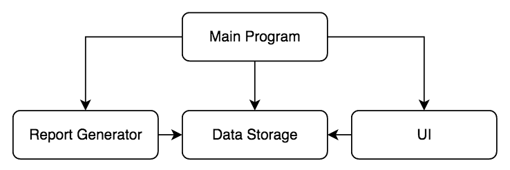

# Python - Inventory Control System #

## About ##

This app is a sample program using a modular design that allows the user to keep track of a company's stock inventory.

---

## UX ##

User Stories:

- As a user, I want to list the different typs of products the company has for sale.
- As a user, I want to know the product code & description of each item.
- As a user, I want to record the minimum stock level per product needed for the inventory.
- As a user, I want to list all the locations where inventory items can be held.
- As a user, I want to define locations as shops, warehouses, storerooms etc.
- As a user, I want to list specific shelves in each location by location code.
- As a user, I want to list the entire company stock with location and current quantity data.
- As a user, I want to add a new item to the inventory.
- As a user, I want to remove an item from inventory.
- As a user, I want to generate a report  on the current inventory items.
- As a user, I want to generate a report of the inventory items needing to be reordered.
- As a user, I want to quit the program.



---

## Features ##

### **The Data Storage Module** ##

- To keep the program as simple as possible, for now, two major design assumptions will be taken:
  - The list of products and locations will be hard-coded into the program.
  - The list of inventory items will be stored in memory and saved to disk whenever the list changes.

- sqlite could be used as a datastore but the aim of this exercise is to explore the overall structure of the program, so keeping the implementation as small as possible is desirable.

### **The User Interface (UI) Module** ###

- Again, to keep the program as simple as possible, for now, major design assumptios are:
  - A simple text-based command-line interface will be used
    - `print()` and `input()` statements will be used for user interaction and displaying data.
  - Creating a GUI is possible but beyond the scope of this exercise as the aim and overall structure of the program doesn't warrant it yet.

User Actions:

|Action|Action Code|
|---|---|
|Add an inventory item|`ADD`|
|Remove an inventory item|`REMOVE`|
|Generate a report of the current inventory items|`INVENTORY_REPORT`|
|Generate a report of the inventory items that need to be re-ordered|`REORDER_REPORT`|
|Quit the program|`QUIT`|

### **The Report Generator Module** ###

- Two types of reports will be created for the user:
  - Current inventory items report (INVENTORY_REPORT)
  - Item re-order report (REORDER_REPORT)

### **The Main Program** ###

- This isn't stictly a module, but a standard Python source file that the user runs to start the program.

---

## Technologies ##

### **Languages** ###

- [Python3](https://www.python.org/)
  - Used to create the main application functionality

### **Libraries / Packages / Modules** ###

### **Tools** ###

- [VS Code](https://code.visualstudio.com/)
  - Code Editor

---

## Deployment ##

The website was developed using VS Code & Git pushed to GitHub, which hosts the repository. I made the following steps to deploy the site:

### **Cloning python** ###

#### **Prerequisites** ###

Ensure the following are installed locally on your computer:

- [Python 3.6 or higher](https://www.python.org/downloads/)
- [PIP3](https://pypi.org/project/pip/) Python package installer
- [Git](https://git-scm.com/) Version Control

#### **Cloning the GitHub repository** ####

- navigate to [simonjvardy/python-modular-programming](https://github.com/simonjvardy/python-modular-programming) GitHub repository.
- Click the **Code** button
- **Copy** the clone url in the dropdown menu
- Using your favourite IDE open up your preferred terminal.
- **Navigate** to your desired file location.

Copy the following code and input it into your terminal to clone Sportswear-Online:

```Python
git clone https://github.com/simonjvardy/python-modular-programming.git
```

#### **Creation of a Python Virtual Environment** ####

*Note: The process may be different depending upon your own OS - please follow this [Python help guide](https://python.readthedocs.io/en/latest/library/venv.html) to understand how to create a virtual environment.*

#### **Install the Python Libraries** ####

Run the following command in your terminal window:

```Python
pip install -r requirements.txt
```

#### **Run the application locally** ####

- TODO

```Python
# TODO
```

---

## Acknowledgements ##

- "Modular Programming with Python" by Erik Westra, [Packt Publishing](https://www.packtpub.com/books/content/support), 2016
